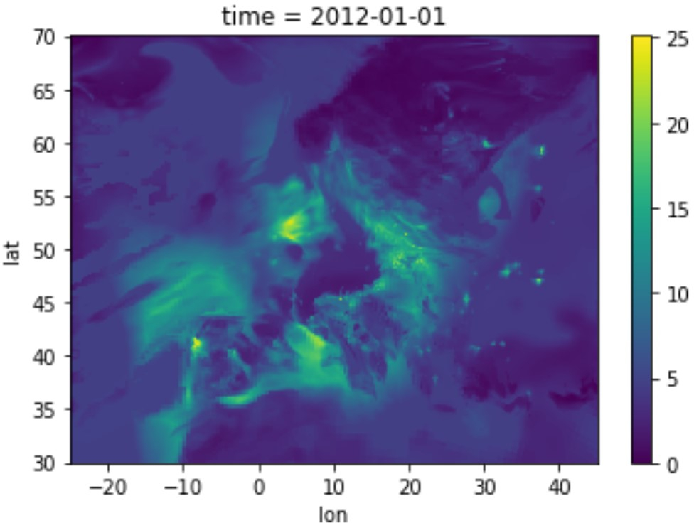

## Analyzing Europe's atmospheric pollution levels using CAMS PM10 data 🛰️🏭

#### Goal: 
to find out which places in Europe were characterized by exceedingly high PM10 concentration levels

#### Data:
- Copercnicus Atmospheric Monitoring Service (CAMS) hourly data on PM10 concentration levels available at: https://www.regional.atmosphere.copernicus.eu/?category=data_access (later moved to: https://ads.atmosphere.copernicus.eu/cdsapp#!/dataset/cams-europe-air-quality-reanalyses?tab=overview)

#### Example area & time: 
Europe, year of 2012

#### Processing steps:
1. Initial preparation
2. Familiarinig with the data
3. Transforming the type of 'time' variable
4. Aggregating hourly data to create a daily product
5. Calculating the number of days characterized by exceedingly high PM10 values, for each place (pixel) in Europe
6. Saving the result as a TIFF file using GDAL

Prepared by: Aleksandra Radecka  
e-mail: aleksandraradecka@protonmail.com  
LinkedIn: https://www.linkedin.com/in/aleksandraradecka/
